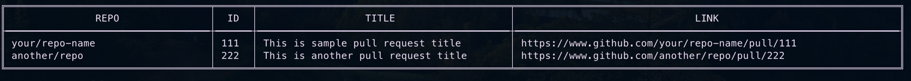

# pr-links
### GitHub CLI Pull Request Viewer

pr-links is a command-line tool written in Go that enhances the functionality of the GitHub CLI by displaying Pull Request information along with their URLs. The GitHub CLI itself lacks the ability to show the Pull Request URL, and this tool bridges that gap.

### Installation

### Example Output

The tool fetches open Pull Requests that are currently assigned to you and presents them in a formatted table. The table includes columns for the repository name, Pull Request ID, truncated title, and a direct link to the Pull Request on GitHub.

### License
This project is licensed under the MIT License - see the [LICENSE](LICENSE.md) file for details.

### Acknowledgments

- GitHub CLI for providing the foundation for interacting with GitHub from the command line.
- alexeyco/simpletable for simplifying the creation of formatted tables in the console.

### Contributing

Feel free to contribute by opening issues or creating pull requests. Your feedback and involvement are highly encouraged!

---
Enjoy using pr-links and feel free to reach out with any feedback or suggestions!